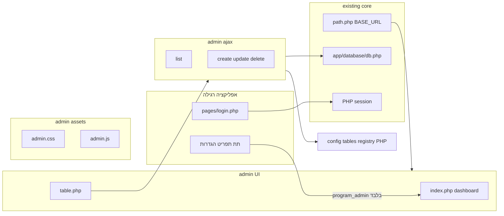

# פאנל ניהול מערכת (Tazrim) — אפיון והתאמה למצב הקיים

## מה בוצע בסריקה (קוד + סכימה ב-repo)

- **תפקיד מנהל ראשי**: בטבלת `users` השדה `role` הוא `varchar(20)` עם ברירת מחדל `'user'`. בקוד מופיע במפורש `role = 'program_admin'` (למשל התראות משוב: [`app/ajax/submit_feedback.php`](app/ajax/submit_feedback.php)). גם נבדק שימוש ברשימת תפקידים כמו `home_admin`, `program_admin`, `admin` בלוגיקת מחיקת חשבון וכו׳ — **ההנחה שלך נכונה**: מנהל תוכנית = `program_admin` ב־`users.role`.
- **אין כרגע תיקיית `admin/`** עם מבנה מלא; יש קבצים נקודתיים כמו [`admin_broadcast.php`](admin_broadcast.php) בשורש — כלומר הפאנל החדש יהיה **שכבה חדשה** ולא הרחבה של מודול קיים.
- **חיבור DB ו־CRUD**: [`app/database/db.php`](app/database/db.php) מספק `selectAll` / `selectOne` / `create` / `update` / `delete` — כאשר `update` ו־`delete` מניחים מפתח ראשי בשם **`id`** (מתאים לרוב הטבלאות בסכימה, אבל לא לכל טבלה אפשרית בעתיד).
- **סכימה מרכזית** (קובץ [`docs/database/tazrim.sql`](docs/database/tazrim.sql)): טבלאות ליבה כוללות בין היתר `users`, `homes`, `categories`, `transactions`, `notifications`, `password_resets`, `ai_api_logs`, `ios_shortcut_links` ועוד. **מיגרציות נוספות** (למשל [`docs/database/migrations/20260415_ai_chats_user_scoped.sql`](docs/database/migrations/20260415_ai_chats_user_scoped.sql)) מוסיפות `ai_chats`, `ai_chat_messages` — הדאמפ הסטטי לא תמיד מלא; בזמן יישום כדאי **להשוות מול DB חי** (או `SHOW TABLES` / מיגרציות אחרונות).
- **עיצוב קיים**: [`assets/includes/setup_meta_data.php`](assets/includes/setup_meta_data.php) טוען פונטים, Font Awesome, jQuery, ו־[`assets/css/user.css`](assets/css/user.css) דרך `tazrim_user_css_href()`. דפי auth משתמשים במחלקות כמו `page-auth`, `auth-cp` (ראו [`pages/login.php`](pages/login.php)).
- **איפוס סיסמה קיים**: טבלת `password_resets` + [`app/ajax/forgot_password_handler.php`](app/ajax/forgot_password_handler.php) + [`pages/forgot_password.php`](pages/forgot_password.php) — נשארים **הזרם היחיד** למשתמשי מערכת (כולל `program_admin`); אין צורך ב־`admin/forgot_password.php` נפרד.

---

## האם הגישה שתיארת "מקובלת"?

**כן — זו גישה סטנדרטית** (דומה ל־Django Admin / Laravel Nova ברמת רעיון): קובץ PHP מרכזי שמגדיר טבלאות ושדות, וממנו נבנים רשימה, טפסים ו־API פנימי.

**חשוב ליישם נכון (לא מובן מאליו):**

| נושא | למה זה קריטי |
|------|----------------|
| **Allowlist בלבד** | שמות טבלאות/שדות מהקונפיג — **אף פעם** לא מהקליינט. כל בקשת AJAX חייבת לבדוק מול הרשמה. |
| **שדות רגישים** | ברירת מחדל "כל השדות הניתנים לעריכה" **מסוכנת** ל־`users` (סיסמה, `remember_token`, `api_token`). צריך ברירת מחדל בטוחה: רשימת שדות מפורשת, או רשימת חריגים גלובלית (`password`, `remember_token`, …). |
| **הצפנה / עיבוד מיוחד** | לדוגמה `homes.initial_balance` עובר דרך `encryptBalance`/`decryptBalance` ב־[`db.php`](app/database/db.php) — שמירה דרך CRUD גנרי חייבת **מיפוי מיוחד** לשדות כאלה. |
| **מפתח ראשי** | הפונקציות הקיימות מניחות `id`. טבלאות ללא `id` או עם מפתח מורכב דורשות חריג או לא נכללות במנגנון הגנרי. |
| **JSON / ENUM / טקסט ארוך** | טפסים גנריים צריכים סוג שדה מהקונפיג או introspection מ־`INFORMATION_SCHEMA` + override ידני. |
| **ביצועים** | `SELECT *` בלי pagination על טבלאות גדולות (למשל `transactions`) — **חובה** דפדוף/סינון בקונפיג. |
| **מחיקות** | **החלטה**: מחיקה פיזית **מותרת** לטבלאות שנכנסות ל־registry (ברירת מחדל: יש מחיקה). עדיין לשים לב ל־FK / השלכות — אחריות המגדיר בקונפיג אילו טבלאות נכנסות. |

אם מקבלים את המגבלות האלה, הפרויקט **בר־ביצוע ומקובל** לפרודקשן — בתנאי שמגדירים אותן במפורש בקונפיג ובשכבת האבטחה.

---

## החלטות מוצר (מעודכן)

- **לוג פעולות אדמין (אודיט)**: **לא נדרש** — לא בונים טבלה/מסך למעקב «מי שינה מה» ב־MVP.
- **מדיניות מחיקה**: **מותרת** מחיקה פיזית לטבלאות ב־registry (ב־UI וב־API); אפשרות עתידית בקונפיג לכבות מחיקה לטבלה ספציפית אם תידרש.
- **הצפנה / עקביות מול האתר**: ליישם במפורש לפי הקוד הקיים — כיום ב־[`app/database/db.php`](app/database/db.php) מפוענח אוטומטית ב־`selectOne`/`selectAll` עמודה **`initial_balance`** (ב־`homes`), ושמירה דרך זרמי האתר משתמשת ב־`encryptBalance()`. בפאנל האדמין: בטעינה להציג ערך מפוענח כמו באתר, ובשמירה **להצפין** לפני `INSERT`/`UPDATE` לאותו שדה — ולא לשמור טקסט גולמי ללא הצפנה. אם יתווספו שדות מוצפנים נוספים בעתיד, יורחבו רשימות ה־`encrypted_columns` / מיפוי ב־registry.

---

## ארכיטקטורה מוצעת (תואמת את מה שביקשת)

- **`admin/`** (בשורש האתר): דפי PHP, `assets/` פנימיים (CSS/JS), `ajax/` (JSON), `includes/` (layout, `auth_check` ייעודי), **`config/registry.php`** (או שם דומה) — רשימת טבלאות, שדות, כותרות בעברית, סוג שדה, וכללי רשימה (מיון, עמודים, סינון).
- **חיבור לליבה**: `require` מ־[`path.php`](path.php), [`app/database/db.php`](app/database/db.php), בלי לשכפל `connect` נפרד.
- **בדיקת הרשאה**: בכל דף ובכל endpoint תחת `admin/` — משתמש **מחובר** (כמו שאר האתר) **וגם** `role === 'program_admin'`. מומלץ לאמת מול ה־DB מדי פעם (או בכניסה לפאנל) כדי שלא יספיק session ישן אם הורידו הרשאה.

### כניסה לפאנל: זרם רגיל + קישור בהגדרות

- **התחברות ואיפוס סיסמה**: משתמשים בזרם הקיים — [`pages/login.php`](pages/login.php), [`pages/forgot_password.php`](pages/forgot_password.php). אין דפי `admin/login` / `admin/forgot` נפרדים.
- **גילוי הפאנל**: בתפריט הצד, תחת **הגדרות**, להוסיף פריט (למשל «פאנל ניהול מערכת») **רק כאשר** `$_SESSION['role'] === 'program_admin'`. מיקום טבעי: מערך ה־submenu ב־[`assets/includes/sidebar_bavbar.php`](assets/includes/sidebar_bavbar.php) (ליד «ניהול הבית», «החשבון שלי»).
- **גישה ישירה ל־URL**: אם מישהו נכנס ל־`admin/` בלי הרשאה — הפניה לדף הבית או להתחברות + הודעה, **לא** לשכפל מסך login בתוך `admin/`.
- **אבטחה**: הקישור בתפריט הוא נוחות בלבד; **כל** טעינת נתונים ו־AJAX חייבים לבדוק `program_admin` בשרת (לא לסמוך על הסתרת הקישור).

### דשבורד

- כרטיסיות עם ספירות (`COUNT(*)`) לטבלאות מהרשמה, אולי "פעילות אחרונה" (למשל תאריך עדכון אחרון אם קיים `updated_at`/`created_at`) — מוגדר בקונפיג כדי לא לנחש.

### CRUD + AJAX

- טבלה: טעינה ראשונית ב־PHP (SEO/מהירות) או מלא ב־AJAX — לפי דפוס האתר; endpoint אחד לרשימה (עם pagination), אחד לשמירה, אחד למחיקה — כולם מחזירים JSON ומשתמשים ב־prepared statements (הרחבה ל־`db.php` או שאילתות ייעודיות באדמין כשצריך טיפוסים נכונים).

### רספונסיביות

- שימוש ב־viewport ובדפוסי layout קיימים (`dashboard-container`, `content-wrapper` אם מתאים), פלוס CSS ייעודי ב־`admin.css` לטבלאות (גלילה אופקית, כרטיסים במובייל).

---

## מה לעשות בפועל בשלב הבא (אחרי אישור התוכנית)

1. לאמת מול **מסד חי** רשימת טבלאות מלאה (כולל מיגרציות אחרונות).
2. לקבוע את **`registry.php`** — פורמט המערך (טבלה, שדות, סוג, `list_columns`, `per_page`; `allow_delete` ברירת מחדל **מופעל**; אופציונלי לכבות לטבלה).
3. לבנות שכבת **`admin/includes/auth.php`** (סשן רגיל + `program_admin`) + עדכון **`sidebar_bavbar.php`** לקישור מותנה; ללא דפי login באדמין.
4. לבנות **`admin/ajax/*.php`** עם CSRF (אם אין היום — להוסיף טוקן לפחות לאדמין).
5. UI משותף: לייבא `setup_meta_data` חלקית או גרסת `setup_meta_data_admin.php` שטוענת את אותם פונטים/גאליות + `admin.css`.

---

## סיכום תשובה ישירה לשאלתך

הגישה שתיארת **מקובלת וסבירה לביצוע**, ובהתאם לארכיטקטורה הקיימת (path, db helpers, עיצוב auth). ההצלחה תלויה ב**קונפיג מפורש**, **הרשאות strict ל־`program_admin`**, ו**חריגים לשדות רגישים/מוצפנים/טבלאות כבדות** — לא ב־CRUD גנרי "חופשי" על כל העמודות כברירת מחדל.
