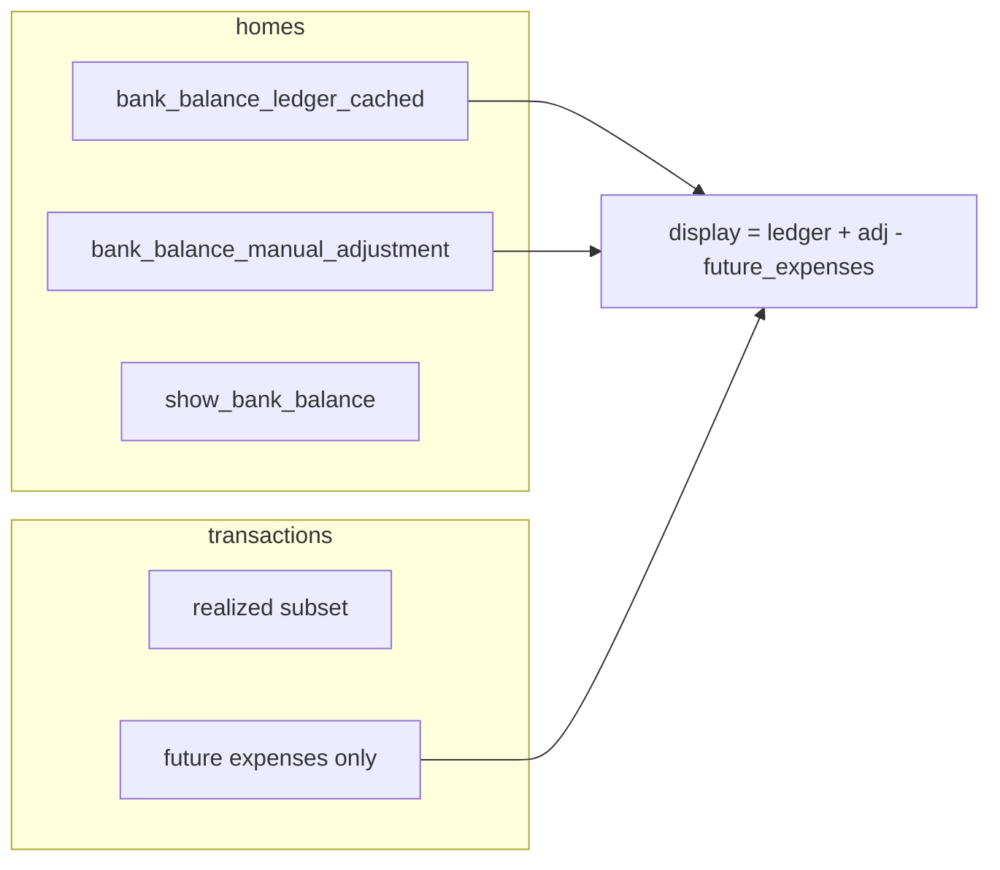

# תוכנית: יתרת בנק (ledger + adjustment) והצגה

## עקרונות (כפי שאושרו)

- **שני שדות מוצפנים ב־`homes`** (בממשק המשתמש נשאר שדה אחד “יתרה בבנק” + צ’קבוקס הצגה):
  - **`bank_balance_ledger_cached`** — יתרה **ממומשת** מתנועות בלבד: הכנסות עם `transaction_date <= היום` פחות הוצאות עם `transaction_date <= היום` (הוצאות עתידיות **לא** נכנסות לכאן).
  - **`bank_balance_manual_adjustment`** — יישור ידני (כולל מה שממיגרציה מהיתרה ההתחלתית הישנה `initial_balance`).
- **תצוגה למשתמש** (דף הבית / דוחות / איפה שמציגים “יתרה בחשבון”):
  - `display = decrypt(ledger) + decrypt(adjustment) - sum(expense WHERE type='expense' AND transaction_date > היום)`
  - **ללא** הכנסות עתידיות בנוסחה (הכנסה עתידית לא מפחיתה ולא מגדילה את המספר הזה).
- **מעקב הצגה**: עמודה **`show_bank_balance`** (TINYINT, ברירת מחדל 0). אם לא הוגדר בהרשמה/ברירת מחדל — לא מציגים KPI (גם אם היתרה 0).

## מיגרציית SQL ונתונים

- **`docs/database/tazrim.sql`**: עדכון מבנה `homes` (שמות עמודות חדשים + `show_bank_balance`).
- **סקריפט מיגרציה** (קובץ PHP חדש תחת `app/database/migrations/` או הרצה חד־פעמית — לפי המוסכמה אצלכם): לכל `home_id`:
  - חישוב `ledger_plain = SUM(income, date<=CURDATE()) - SUM(expense, date<=CURDATE())` (לפי אותו `$today` כמו באתר — עדיף להשתמש בפונקציית ליבה אחת).
  - **`adjustment_plain = decrypt(initial_balance)`** (היתרה ההתחלתית הישנה כולה נכנסת ליישור — מתאים לנוסחה: תצוגה ישנה = ledger + adjustment - עתידי, כאשר לפני המיגרציה העתידי כבר נספר ב־net הישן; ראו הערת דיוק למטה).
  - הצפנה ושמירה לשדות החדשים; **הסרה/החלפה** של `initial_balance`.

**דיוק מיגרציה**: היום בקוד ([`app/includes/render_home_dashboard_core.php`](app/includes/render_home_dashboard_core.php)) היתרה הייתה `initial + income(<=today) - expense(הכל)`. אחרי המעבר, **`ledger` לא כולל הוצאות עתידיות** אבל **`display` מחסיר אותן במפורש**, כך ש־`ledger + adj - future` אמור ליישר לתצוגה הישנה **אם** `adj` אתחול נכון. המיגרציה תשתמש בפונקציית ליבה **`tazrim_migrate_home_balance_from_initial_balance($conn, $home_id)`** שמחשבת `ledger_plain`, `future_exp`, `old_initial` ומגדירות `adjustment_plain` כך ש־`ledger + adj - future` תואם לערך שהיה מוצג לפני המיגרציה (נבדק מול דוגמה אלגברית בקוד/בדיקה ידנית).

### ביצועים במיגרציה (Large DB)

- אלפי בתים עם לולאת PHP (`decrypt`/`encrypt` לכל שורה) עלולה לחרוג מ־**max_execution_time** או מ־timeout של **PHP-FPM / Apache**.
- **המלצות יישום**:
  - מיגרציה ב־**chunks** (למשל 100–500 `home_id` בכל קריאה) עם אפשרות להמשיך מ־`last_id` (או להריץ סקריפט CLI עם `set_time_limit(0)`).
  - להריץ בסביבת ייצור עם **`ignore_user_abort`** / הגדלת timeout זמני **רק** לסקריפט המיגרציה.
  - הצפנה ב־**PHP (AES)** — **אין** המרה בטוחה ב־SQL טהור; אם בעתיד יועבר לעמודות מספריות גלויות, אפשר יהיה לשקול טעינה ב־SQL + הצפנה בפוסט־פרוסס — **לא** כחלק מהמיגרציה הראשונה.

### טיפול ב־NULL וערכים ריקים (מסד + `db.php`)

- **בסכמה**: להגדיר ש־`bank_balance_ledger_cached` ו־`bank_balance_manual_adjustment` מאפשרים `NULL` **או** ברירת מחדל שמייצגת **מוצפן של 0** (אחרי ש־`encryptBalance(0)` קיים בקוד המיגרציה) — כדי שלא יישמרו מחרוזות ריקות שמבלבלות.
- ב־[`app/database/db.php`](app/database/db.php):
  - **`encryptBalance`**: לטפל ב־`null` / מחרוזת ריקה כ־**0** (או להחזיר `null` בצורה עקבית עם ה־`UPDATE` בבסיס).
  - **`decryptBalance`**: אם הפענוח נכשל או הערך אינו תקין — להחזיר **`0.0`** (float) ולא לזרוק ל־חישובים ערכים שגויים; לוודא שאין מצב ש־`false` מגיע לחיבור מתמטי.
- ב־`selectOne`/`selectAll` אחרי פענוח העמודות המוצפנות — לוודא שטיפוסים **תמיד** מספריים לשימוש ב־`update_home` / חישובים.

## פונקציית ליבה (קובץ חדש)

יצירת [`app/functions/home_bank_balance.php`](app/functions/home_bank_balance.php) (נכלל מ־`path.php` או `require_once` ממקומות קריאה — לפי המוסכמה הקיימת בפרויקט):

| פונקציה | תפקיד |
|--------|--------|
| `tazrim_realized_ledger_plain_from_row($type, $amount, $transaction_date, $today)` | האם פעולה נספרת ב־ledger (ממומשת) ומה הסימן (+/-). |
| `tazrim_adjust_home_ledger_cached_by_delta(mysqli $conn, int $home_id, float $delta)` | קריאת `bank_balance_ledger_cached` (דרך `selectOne` או SQL ישיר + `decryptBalance`), חיבור דלתא, הצפנה, `UPDATE`. |
| `tazrim_set_home_manual_adjustment(mysqli $conn, int $home_id, float $plain)` | עדכון `bank_balance_manual_adjustment` מוצפן (שימוש ב־`update()` או SQL מקומי). |
| `tazrim_recompute_home_ledger_cached_from_db(mysqli $conn, int $home_id)` | **תיקון/מיגרציה/Bulk**: חישוב `SUM` ממומש ועדכון `ledger` (ללא שינוי `adjustment`). |
| `tazrim_home_display_bank_balance(mysqli $conn, int $home_id, string $today_il)` | מחזיר מערך: `ledger_dec`, `adjustment_dec`, `future_expenses_sum`, `display` — לשימוש ב־KPI ובדוחות. |
| `tazrim_reset_home_bank_balance_fields(mysqli $conn, int $home_id)` | מאפס את שני השדות המוצפנים ל־**0** (הצפנה + עדכון). |
| אופציונלי: `tazrim_after_transaction_mutation(...)` | עוטף: חישוב דלתא מ־before/after וקריאה ל־`adjust_home_ledger_cached_by_delta`. |

**הערה**: [`encryptBalance`](app/database/db.php) כבר מקבל מחרוזת/מספר; יש לוודא שהטפסים שולחים float שלילי תקין (למשל `step="0.01"` וללא `min` שחוסם מינוס ב־[`pages/settings/manage_home.php`](pages/settings/manage_home.php) / [`pages/welcome.php`](pages/welcome.php)).

### מחיקת כל התנועות / “יתרת רפאים”

- **מצב**: אחרי מחיקה מוחלטת של כל התנועות, **`bank_balance_ledger_cached`** אמור להגיע ל־**0** (דרך דלתאות אחרי כל מחיקה **או** קריאה ל־`tazrim_recompute_home_ledger_cached_from_db` אחרי פעולת bulk מחיקה).
- **בעיה**: אם **`bank_balance_manual_adjustment`** לא מאופס, נשארת **יתרה “רפאים”** (תצוגה לא מתאימה לתנועות ריקות).
- **מוצר**: להוסיף ב־**הגדרות ניהול הבית** כפתור **“איפוס יתרה”** (עם אישור) שמבצע **`tazrim_reset_home_bank_balance_fields`** — מאפס **שני** השדות המוצפנים ל־0 (או לערך המוצפן של 0). אופציונלי: להציע איפוס אוטומטי אחרי “מחק את כל התנועות” אם קיים זרם כזה — אם לא, לפחות **המלצה ב-UI** או איפוס ידני.

## עדכון `db.php`

- ב־[`app/database/db.php`](app/database/db.php), להחליף את רשימת `encrypted_columns` ב־`selectAll`/`selectOne`: **`initial_balance` → `bank_balance_ledger_cached`, `bank_balance_manual_adjustment`** (ולהסיר את השם הישן אחרי המיגרציה).

## נקודות קריאה/כתיבה באתר (ללא `application/`)

### ליבת תצוגה
- [`app/includes/render_home_dashboard_core.php`](app/includes/render_home_dashboard_core.php): להסיר את שאילתת `net_balance` + חיבור `initial_balance`; להחליף בקריאה ל־`tazrim_home_display_bank_balance` ולהעביר משתנים ל־partial.
- [`app/includes/partials/home_dashboard_core_markup.php`](app/includes/partials/home_dashboard_core_markup.php): תנאי הצגה לפי `show_bank_balance` (ולא `initial_balance != 0`); עיצוב לפי `display`.

### AJAX / פעולות
- [`app/ajax/add_transaction.php`](app/ajax/add_transaction.php): אחרי `INSERT` מוצלח — עדכון ledger לפי הפעולה (אם ממומשת).
- [`app/ajax/edit_transaction.php`](app/ajax/edit_transaction.php): לפני `UPDATE` — `SELECT` לשורה הישנה; אחרי הצלחה — דלתא = effect(new) − effect(old) (כיום משתנה `amount` בלבד; אם בעתיד יתווסף `transaction_date`, אותה פונקציה תטפל).
- [`app/ajax/delete_transaction.php`](app/ajax/delete_transaction.php): לפני מחיקה — snapshot; אחרי — היפוך אפקט.
- [`assets/includes/process_recurring.php`](assets/includes/process_recurring.php): אחרי כל `INSERT` מוצלח ל־`transactions` (בתוך הלולאה) — קריאה לעדכון ledger לאותה פעולה (תאריך מחושב, בדרך כלל ממומש ביחס ל־`$today_il` — להשתמש באותו `$today` כמו בשאר המערכת; אם הקובץ לא מגדיר `today_il`, להעביר מ־`index` או להגדיר מקומית `date('Y-m-d')` באופן עקבי).

### הגדרות בית
- [`app/ajax/update_home.php`](app/ajax/update_home.php): שמירת שם + **`show_bank_balance`** + שדה יתרה יחיד מהמשתמש:
  - חישוב `adjustment_plain = user_entered_display_target - ledger_plain + future_expenses_sum` (כך ש־`ledger + adj - future` = מה שהמשתמש הזין), או נוסחה שקולה שתוגדר בפונקציית ליבה אחת `tazrim_apply_user_bank_balance_target(...)`.
- [`app/ajax/setup_welcome.php`](app/ajax/setup_welcome.php): אתחול `ledger`/`adjustment`/`show` בהתאם לטופס welcome.
- [`pages/settings/manage_home.php`](pages/settings/manage_home.php): שדה מספר (מותר מינוס), צ’קבוקס הצגה, שמות שדות POST חדשים; **כפתור “איפוס יתרה”** + endpoint AJAX `app/ajax/reset_home_balance.php` (או בתוך `update_home` עם פעולה נפרדת) שקורא ל־`tazrim_reset_home_bank_balance_fields`.
- [`pages/welcome.php`](pages/welcome.php): אותו דבר + שידור ל־`setup_welcome`.

### הרשמה / יצירת בית
- [`app/controllers/users.php`](app/controllers/users.php): ב־`create('homes', ...)` להוסיף ברירות מחדל: `show_bank_balance = 0`, `bank_balance_*` מוצפנים (0 או NULL לפי החלטה — עקבי עם `encryptBalance`).

### דוחות
- [`pages/reports.php`](pages/reports.php): היום ה־KPI “מאזן” הוא הכנסות־הוצאות **בחודש הנבחר בלבד** — **לא** להחליף בטעות ביתרת בנק גלובלית. להוסיף (או להבהיר ב-UI) **בלוק נפרד** “יתרת חשבון (מוערכת)” שמשתמש ב־`tazrim_home_display_bank_balance` **אם** `show_bank_balance`, כדי שיתאים לדף הבית.

## פאנל אדמין וסוכן AI

- [`admin/config/registry.php`](admin/config/registry.php): החלפת שדות `homes` (שמות + תווית; הוספת `show_bank_balance`).
- [`admin/includes/helpers.php`](admin/includes/helpers.php): מיפוי פענוח/הצפנה לעמודות החדשות.
- [`admin/ajax/list.php`](admin/ajax/list.php), [`admin/ajax/lookup.php`](admin/ajax/lookup.php): אותו מיפוי.
- [`admin/features/ai_chat/services/agent_schema.php`](admin/features/ai_chat/services/agent_schema.php): `admin_ai_agent_encrypt_map` — עמודות חדשות.
- [`admin/features/ai_chat/services/prompt_builder.php`](admin/features/ai_chat/services/prompt_builder.php): דוגמאות/טקסטים שמזכירים `initial_balance`.
- [`admin/features/ai_chat/api/agent_data.php`](admin/features/ai_chat/api/agent_data.php): אם יש רשימת עמודות מוצפנות ל־`homes` — לעדכן.
- [`admin/features/ai_chat/api/agent_execute.php`](admin/features/ai_chat/api/agent_execute.php): עדכון הערה בלבד.
- **CRUD סוכן על `transactions`**: ב־[`admin/features/ai_chat/services/agent_execute_dispatch.php`](admin/features/ai_chat/services/agent_execute_dispatch.php):
  - אחרי **שורה בודדת** — עדכון ledger בדלתא (כמו באתר) **או** קריאה ל־`tazrim_recompute_home_ledger_cached_from_db` ל־`home_id` המושפע.
  - **פעולות Bulk** (למשל “מחק את כל ההוצאות של חודש X” אם יש שימוש כזה או SQL שמוחק מספר שורות): **חובה** לסיים ב־**סנכרון מלא** — לולאה על `home_id` ייחודיים שנפגעו + `tazrim_recompute_home_ledger_cached_from_db($conn, $home_id)` **לכל בית**, או קריאה אחת אחרי ה־Bulk שמזהה את ה־`home_id` מה־payload/SQL. **מטרה**: למנוע **Drift** בין ledger לבין מצב הטבלה `transactions`.

## אתר — AI chat (לא אדמין)

- [`app/features/ai_chat/services/prompt_builder.php`](app/features/ai_chat/services/prompt_builder.php): שאילתות/שמות שדות שמפנים ל־`homes`.

## מה לא נכלל (לפי בקשתך)

- כל תיקיית [`application/`](application/) — ללא שינוי בגרסה הזו.

## בדיקות ידניות מומלצות

- בית חדש: ברירת מחדל לא מציג יתרה; הפעלת הצגה + יתרה שלילית.
- הוספת הוצאה/הכנסה ממומשת — שינוי ledger; עתידית — ללא שינוי ledger; תצוגה משתנה ב־`future` בלבד.
- עריכת סכום פעולה ממומשת — דלתא נכונה.
- מחיקה — היפוך.
- הזרקה מ־`process_recurring` — ledger מתעדכן כשהתאריך ממומש.
- יישור ידני בהגדרות — `adjustment` מתעדכן, התצוגה תואמת קלט.
- מיגרציה על עותק DB עם נתונים ישנים — השוואה לפני/אחרי למספר יתרה אחד לדוגמה.
- מחיקת כל התנועות — `ledger` = 0; בדיקת “רפאים” ב־adjustment אם לא אופס; כפתור “איפוס יתרה”.
- סוכן אדמין — מחיקה ב־bulk / `transactions` — `ledger` תואם אחרי `recompute`.
- ערכי NULL/ריק בבסיס — אין פענוח שגוי ואין חישובים עם non-finite.
