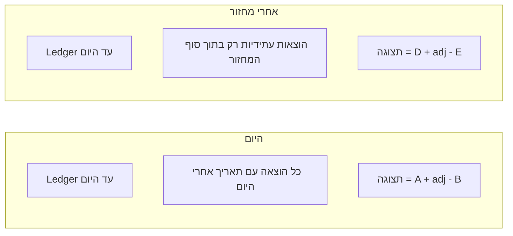

# מחזור חיוב פר-בית — מצב קיים ומשמעות בפועל

## איך זה עובד היום (לפי הקוד)

יש כאן **שני דברים נפרדים**, ולא "מחזור חיוב = חודש שלם":

1. **סיכומי הכנסות/הוצאות בדשבורד (ווב + API)**  
   נספרים לפי **חודש קלנדרי** של `transaction_date`: `MONTH(...) = m` ו־`YEAR(...) = y` (למשל ב־[`app/includes/render_home_dashboard_core.php`](app/includes/render_home_dashboard_core.php) וב־[`application/api/v1/dashboard/init.php`](application/api/v1/dashboard/init.php)).  
   זה **לא** מחזור חיוב מותאם — זה פשוט ינואר/פברואר וכו'.

2. **יתרת חשבון / "הוצאות קדימה"**  
   ב־[`app/functions/home_bank_balance.php`](app/functions/home_bank_balance.php):
   - **Ledger ממומש**: כל הכנסה/הוצאה עם `transaction_date <= היום`.
   - **סכום עתידי**: `tazrim_home_future_expenses_sum` — **כל** הוצאה עם `transaction_date > היום`, **בלי סוף טווח** (לא חודש, לא מחזור).
   - **תצוגה**: `display = ledger + adjustment - future_expenses` — כלומר מחסרים מהיתרה **את כל העתיד**, לא רק עד סוף מחזור.

רשימת "ממתינות" בדשבורד **משלבת**: עתיד (`> today`) **וגם** חודש קלנדרי נבחר — כך שזה עדיין לא מחזור חיוב, אלא סינון לפי חודש שבחרת בממשק.

**מסקנה:** התיאור "חודש שלם + הוצאות עתידיות עד אין סוף" מדויק רק בחלקו: החודש מופיע בסיכומים/רשימות (לוח שנה); **החיסור ליתרה** הוא באמת **עד אין סוף**.

---

## מה "מחזור חיוב פר בית" אמור לומר בפועל

אם לכל בית מגדירים **יום בחודש** (1–31, עם כללי edge לחודשים קצרים), אפשר להגדיר **טווח תאריכים של המחזור הנוכחי** (למשל מ־יום־החיוב כלול ועד יום לפני יום־החיוב הבא — או ההפך; חשוב לבחור הגדרה אחת עקבית).

**בפועל זה משפיע על מה ששאלת כך:**

| אזור | האם "טווח המחזור" רלוונטי? |
|------|------------------------------|
| **יתרת תצוגה (מינוס הוצאות קדימה)** | כן — במקום לחסר **כל** `transaction_date > today`, מחסרים רק הוצאות **בתוך המחזור הנוכחי שעדיין לא חלו** (למשל מ־מחר ועד סוף המחזור), או לפי הגדרה שתבחרו. זה מתקן את הלוגיקה האגרסיבית של היום. |
| **סיכומי הכנסות/הוצאות בדשבורד** | רק אם **מחליפים** סינון חודש קלנדרי ב"תנועות בין תחילת מחזור לסוף מחזור". אחרת נשארים עם חודש קלנדרי גם אחרי שמוסיפים יום חיוב. |
| **דוחות / AI context** | אם רוצים עקביות — אותם טווחים או פרמטר נפרד לדוח קלנדרי vs מחזורי. |

אין בקוד היום ישות "יחידה" נפרדת מהבית לנושא הזה — כוונתך כנראה **כל מקום במערכת שמציג או מחשב לפי טווח תאריכים**; זה ידרוש החלטה: **רק יתרה** מול **גם כל הדשבורד והדוחות**.

---

## הטמעה טכנית (כשתאשרו לבצע)

- **DB**: עמודה ב־`homes`, למשל `billing_cycle_day` (tinyint 1–31), ברירת מחדל 1 (מתנהג כמו "חודש קלנדרי" אם גם מחליפים לוגיקת טווח בהתאם).
- **פונקציית ליבה**: חישוב `cycle_start`, `cycle_end` לתאריך "היום" (Asia/Jerusalem, כמו `$today_il` היום) + טיפול ב־31 בפברואר וכו'.
- **עדכון** [`tazrim_home_future_expenses_sum`](app/functions/home_bank_balance.php) (או עטיפה): להגביל `transaction_date` ל־`(today, cycle_end]` או למגבלה שתוגדר, במקום עד אינסוף.
- **פריסה**: כל קריאה ל־`tazrim_home_display_bank_balance` / סיכומי עתיד — לוודא שימוש באותה פונקציה; לבדוק גם [`application/api/v1/dashboard/transactions.php`](application/api/v1/dashboard/transactions.php), [`app/ajax/fetch_transactions.php`](app/ajax/fetch_transactions.php), ודוחות ב־[`application/api/v1/reports/summary.php`](application/api/v1/reports/summary.php) אם מרחיבים מעבר ליתרה.
- **UI ניהול בית**: שדה בחירה (1–31) + הסבר קצר למשתמש מה זה משנה (יתרה / או גם סיכומים — לפי ההחלטה למעלה).

---

## החלטת מוצר שכדאי לאשר לפני קוד

- **האם יום החיוב משנה רק את חישוב יתרת התצוגה**, או גם את **סיכומי הכנסות/הוצאות** וה־month picker (מעבר ל"מחזור" במקום חודש קלנדרי)?

ברירת מחדל סבירה לשלב ראשון: **לתקן רק את יתרת התצוגה וההוצאות העתידיות** (הבעיה ה"שורשית" שתיארת), ולהשאיר דשבורד קלנדרי עד שתרצו ליישר גם אותו.
