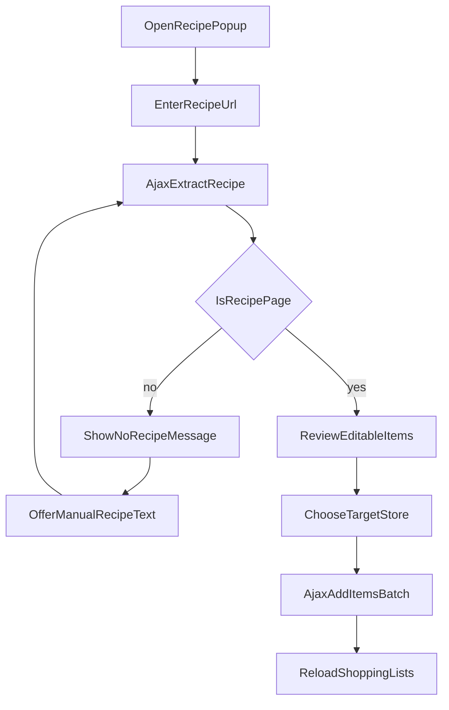

# תכנית: מתכון -> רשימת קניות

## מה נבנה
- כפתור חדש בעמוד הקניות שפותח פופאפ בסגנון המודאלים הקיימים.
- בפופאפ: הזנת URL, שליפת תוכן מתכון בצד שרת, אימות שזה מתכון, חילוץ רשימת מצרכים + כמות (כחלק משם המוצר), תצוגת רשימת פריטים לעריכה/מחיקה.
- בחירת חנות בתוך הפופאפ והוספת כל הפריטים שנשארו בלחיצה אחת לרשימת הקניות.
- מימוש רוב הזרימה ב-AJAX, כולל מצבי טעינה/שגיאה, והתנהגות זהה לפופאפים אחרים באתר.

## קבצים עיקריים לשינוי
- [pages/shopping.php](/Applications/XAMPP/xamppfiles/htdocs/tazrim/pages/shopping.php) — הוספת כפתור פתיחה + Markup של מודאל "ממתכון לרשימה" + חיבור אירועים.
- [app/ajax/fetch_shopping_lists.php](/Applications/XAMPP/xamppfiles/htdocs/tazrim/app/ajax/fetch_shopping_lists.php) — שימוש קיים לטעינת חנויות זמינות (לבחירה בפופאפ), ללא שינוי חוזה.
- [app/ajax/save_shopping_item.php](/Applications/XAMPP/xamppfiles/htdocs/tazrim/app/ajax/save_shopping_item.php) — שימוש קיים לשמירת פריט בודד; נרחיב/נוסיף endpoint אצווה.
- חדש: `app/ajax/extract_recipe_items.php` — מקבל URL/טקסט ידני, מבצע ולידציה, מחלץ פריטים מ-Gemini, מחזיר JSON מסודר.
- חדש: `app/ajax/add_recipe_items_to_shopping.php` — מקבל `category_id` + מערך שמות פריטים ומוסיף אותם בבת אחת.
- [assets/js/tazrim_dialogs.js](/Applications/XAMPP/xamppfiles/htdocs/tazrim/assets/js/tazrim_dialogs.js) — ללא שינוי לוגיקה, רק היצמדות לשפה/UX של דיאלוגים קיימים דרך `tazrimAlert`/`tazrimConfirm`.
- [app/ajax/ai_sort_category.php](/Applications/XAMPP/xamppfiles/htdocs/tazrim/app/ajax/ai_sort_category.php) — התאמת פרומפט המיון להתעלמות מכמויות/יחידות בתחילת שם המוצר.

## זרימת המוצר (UX)

## אימות "זה באמת מתכון" ומניעת פספוסים
- בצד שרת נבצע ניסיון שליפת HTML מה-URL (cURL), חילוץ טקסט עיקרי + איתור סכמות Recipe (`application/ld+json` עם `@type=Recipe`) כשהן קיימות.
- בבקשות cURL נוסיף כותרות דפדפן אמיתי (`User-Agent`, `Accept`, `Accept-Language`) ו-timeout שמרני כדי להפחית חסימות Bot.
- נשלח ל-Gemini בקשה עם `response_mime_type: application/json` ו-`response_schema` קשיח לפורמט `is_recipe`, `items[]`, `warnings[]` כדי למנוע טקסט חופשי.
- נבקש מהמודל להחזיר *רק* רשימת מצרכים, כל פריט עם כמות בתוך שם הפריט כפי שמופיע במקור (גרם/ליטר/יחידות/כפות וכו').
- נוסיף שכבת ולידציה אחרי ה-AI: סינון כפילויות, סינון שורות ריקות, ודגל אזהרה אם התקבלו מעט מדי פריטים/חסר מבנה של מצרכים.
- במקרה לא-מתכון או ביטחון נמוך: לא מוסיפים כלום אוטומטית, מציגים הודעה + אפשרות להדביק טקסט מתכון ידנית (כפי שביקשת).

## אופטימיזציית LD+JSON (מסלול מהיר)
- ב-[app/ajax/extract_recipe_items.php](/Applications/XAMPP/xamppfiles/htdocs/tazrim/app/ajax/extract_recipe_items.php) נוסיף מסלול עדיפות: אם זוהה `@type=Recipe` ובתוכו `recipeIngredient`, נשלח ל-Gemini רק את שם המתכון + מערך המצרכים הגולמי במקום את כל טקסט העמוד.
- המודל יתבקש רק לנקות/לאחד ניסוחים ולהחזיר JSON סופי תקני, בלי שלב "קריאה חופשית" של כל הדף.
- אם `recipeIngredient` חסר או לא תקין, נבצע fallback למסלול המלא (חילוץ טקסט עמוד + עיבוד רגיל).
- נוסיף בשדה התגובה הפנימי `source_mode` (`ld_json` / `full_text`) לצורכי ניטור ביצועים ודיבוג.

## יציבות מסד נתונים (Batch Insert)
- ב-[app/ajax/add_recipe_items_to_shopping.php](/Applications/XAMPP/xamppfiles/htdocs/tazrim/app/ajax/add_recipe_items_to_shopping.php) נעטוף את כל ההכנסות ב-Transaction (`BEGIN`/`COMMIT`).
- במקרה של כשל בפריט כלשהו: `ROLLBACK` מלא + הודעת שגיאה ברורה למשתמש (ללא מצב "חצי רשימה").
- נוסיף מענה JSON עם `inserted_count` רק אחרי commit מוצלח.

## Pantry Staples (מוצרי יסוד)
- בסכמת ה-JSON של Gemini נוסיף לכל פריט שדה בוליאני `is_staple` (ברירת מחדל `false`), עם הנחיה מפורשת לסמן `true` עבור מוצרי מזווה נפוצים (למשל מלח, פלפל, מים, שמן בסיסי, סוכר).
- במסך ה-review בפופאפ, פריטים עם `is_staple=true` יוצגו ברשימה אך בברירת מחדל לא מסומנים להוספה.
- כפתור ההוספה ישלח רק פריטים שסומנו בפועל; כך לא נכנסים למסד פריטי יסוד אלא אם המשתמש אישר אקטיבית.
- נשמור שקיפות למשתמש: תווית/רמז ויזואלי ליד פריט יסוד כדי שיבין למה הוא לא מסומן כברירת מחדל.

## התאמה למנגנון מיון AI קיים
- נעדכן את פרומפט המיון ב-[app/ajax/ai_sort_category.php](/Applications/XAMPP/xamppfiles/htdocs/tazrim/app/ajax/ai_sort_category.php) כך שינחה להתייחס למוצר הבסיס ולהתעלם מכמויות/יחידות (למשל "2 כוסות חלב" => "חלב").
- נשמור תאימות לאחור: גם פריטים רגילים ללא כמות ימשיכו להתמיין כרגיל.

## הערה על Gemini API חינמי
- אפשרי טכנית גם במסלול החינמי (במיוחד עם `gemini-2.5-flash` שכבר בשימוש אצלך).
- צריך לצפות למגבלות קצב/נפח וטיפול ב-429/503 (כבר קיים אצלך דפוס רטריי ב-[app/ajax/ai_sort_category.php](/Applications/XAMPP/xamppfiles/htdocs/tazrim/app/ajax/ai_sort_category.php)).
- ניישם timeout, הודעת "נסה שוב", וגיבוי טקסט ידני כדי לשמור חוויית שימוש רציפה גם כשהשירות עמוס.

## בדיקות קבלה
- URL של מתכון תקין מחזיר רשימה מלאה יחסית של מצרכים + כמויות בתוך שם הפריט.
- URL שאינו מתכון לא מוסיף פריטים ומציג מסלול fallback לטקסט ידני.
- המשתמש יכול למחוק פריטים לפני הוספה ולבחור חנות יעד מתוך החנויות הקיימות.
- לחיצה על "הוספה" מוסיפה את כל הפריטים שנשארו, מרעננת רשימה, ומתיישבת עם ההתנהגות הקיימת של הדף.
- UI/נעילת גלילה/סגירת מודאל תואמים לדפוס הקיים בעמוד הקניות.
- בזמן טעינה מוצג סטטוס טקסטואלי מתקדם ("קורא את המתכון...", "מחלץ מצרכים..."), וכפתור/סגירה חיצונית מנוטרלים עד סיום הבקשה.
- כאשר קיים `recipeIngredient`, התהליך רץ במסלול `ld_json` ומחזיר תוצאה מהירה יותר משמעותית מהמסלול המלא.
- פריטים עם `is_staple=true` אינם נשלחים כברירת מחדל, אך המשתמש יכול לסמן ידנית ולהוסיף אותם אם צריך.