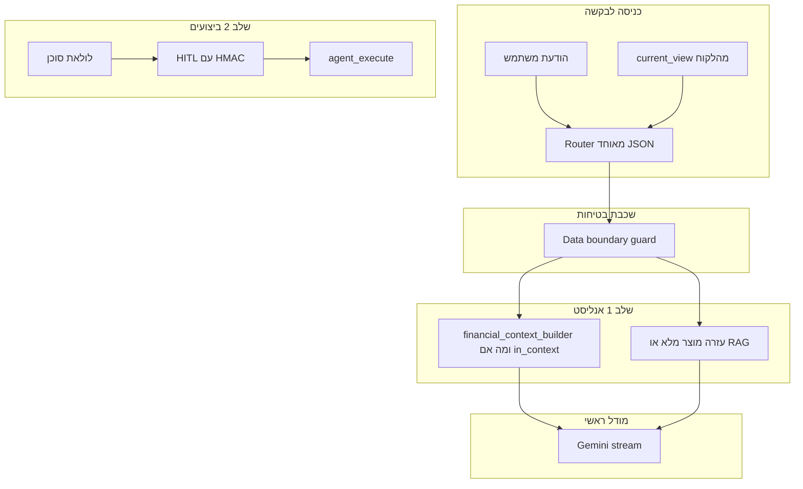

# תכנון אבולוציה לסוכן AI למשתמש קצה

## עקרונות מגבילים (מסכמים את דרישותיך)

- **לא לשנות** את מודול הצ'אט של הפאנל ([`admin/features/ai_chat/`](admin/features/ai_chat/)) — לא טבלאות `admin_ai_*`, לא `stream_message.php` / `agent_execute.php` של האדמין.
- **טבלאות צ'אט משתמש** ([`ai_chats` / `ai_chat_messages`](docs/database/migrations/20260415_ai_chats_user_scoped.sql)): עדיף לשמור על הסכמה הקיימת; לאחסן הצעות פעולה כטקסט/JSON בתוך `content` (כמו `[[ACTION_PROPOSED]]` אצל האדמין) כדי להימנע ממיגרציות חובה.
- **כתיבה (שלב 2)**: מדיניות **שיקוף הרשאות הממשק** — כל פעולה עוברת אותם כללי גישה כמו בדפים הרלוונטיים (אימות `home_id`, תפקידים/דגלים קיימים, וכו').
- **נתונים אישיים / פרופיל משתמש (חד ולא ניתן לעקיפה)**: כל שליפה, הצגה או כתיבה הקשורה ל**פרטי משתמש** (פרופיל, העדפות אישיות, מפתחות ב־`ai_user_preferences`, התראות אישיות וכו') — **רק** עבור `user_id` של המשתמש המחובר מהסשן. **אסור** לגעת בנתוני משתמש אחר **גם אם** הוא באותו `home_id`. אין להסיק `user_id` מהלקוח או מהמודל לצורך כתיבה; רק הסשן.
- **ניסוחים**: כל הודעות מערכת, כפתורי אישור/דחייה, שגיאות וולידציה — מותאמים ל**משתמש קצה** (לא טון/מונחים של מנהל).

### צ'אט אחד — בלי בחירת "תזרים" / "המערכת"

- **מוצר**: המשתמש לא בוחר נושא; יש **מסך צ'אט יחיד** והמערכת **מנתבת אוטומטית** כל הודעה.
- **מימוש**:
  - להסיר את שער הנושא (topic gate), את רצועת ה־chips ואת נעילת הנושא מ־[`bootstrap.php`](app/features/ai_chat/bootstrap.php) / [`ai-chat.js`](app/features/ai_chat/assets/ai-chat.js).
  - להפסיק לשלוח `scope: { topic }` מהלקוח כמקור אמת; ב־[`stream_message.php`](app/features/ai_chat/api/stream_message.php) הניתוב הקיים + הרחבה יקבעו מה לשלב בפרומפט: בלוק עזרת מערכת (מדריך / RAG), בלוק פיננסי, או שניהם (שאלה מעורבת).
  - `scope_snapshot` ב־DB: אפשר לצמצם ל־`{}` או שדה גרסה בלבד, או לשמור רק **תוצאת ניתוב אחרונה** לצרכי דיבוג (לא נדרש לבחירת משתמש).

### גבול נתונים חד — שום דבר מחוץ ל־`home_id` של המשתמש המחובר

- **איום**: גם עם פרומפט "נאמנות", מניפולציה בשאלה או הזיהוי השגוי של הניתוב לא יאפשרו דליפה של נתוני בית אחר.
- **עקרון**: כל טקסט שנכנס ל־Gemini (כולל היסטוריית צ'אט, בלוקי "נתונים", תוצאות כלים עתידיים) חייב לעבור **שכבת Gate** לפני השליחה.
- **מימוש מומלץ (שכבות, לא "בטח המודל יבין")**:
  1. **מקור אמת יחיד**: `home_id` לנתוני בית משותפים, ו־`user_id` של המשתמש המחובר לנתונים אישיים — **רק** מהסשן; לא מקבלים מזהים מהלקוח לצורך שליפה או עדכון.
  2. **בוני הקשר**: פונקציות PHP עם `WHERE home_id = ?` לנתוני בית, או `WHERE user_id = ?` (המחובר בלבד) לטבלאות אישיות — whitelist טבלאות/שאילתות; אין SQL דינמי שמורכב מהמודל.
  3. **Data boundary guard (תת־סוכן / בקרה)** לפני כל קריאה ל־Gemini:
     - **דטרמיניסטי**: וידוא שכל שורה שנכללה בדאטה עברה דרך builder שמקושר ל־`$homeId` מהסשן; איסור הדבקת טקסט חיצוני ללא מקור; אורך מקסימלי לבלוק.
     - **אופציונלי — תת־מודל קטן/מהיר**: רק לסיווג או לזיהוי דליפה פורמלית (למשל "האם הבלוק הבא מכיל מזהה בית שאינו X") עם **הנחיות קשיחות** ופלט JSON מצומצם; אם נכשל — לא לשלוח את הבלוק המלא למודל הראשי, אלא להחליף בהודעת שגיאה פנימית או רק אגרגט מאושר.
  4. **פעולות (שלב 2)**: ב־dispatch, אימות `home_id` על ישויות בית; על ישויות פרופיל — אימות ש־`user_id` בשורה הוא **רק** המשתמש המחובר לפני כל `UPDATE`/`DELETE`/`SELECT` רגיש.

### שאלות מרובות ולולאת סוכן פנימית (כמו באדמין)

- **כן — מתוכנן במפורש**: זרימת **`[[QUESTIONS]]` / `[[/QUESTIONS]]`** (רשימת שאלות, כל אחת עם טקסט ואופציונלית אפשרויות), אירוע SSE **`questions`**, והמשתמש עונה (בחירה או טקסט חופשי — לפי מורכבות ה־UI). בתור המשך, השרת מזין ללולאה הקשר שאלות שנענו (מקביל ל־`admin_ai_chat_build_questions_context_text` / `[[QUESTIONS_CONTEXT]]` ב־[`admin/features/ai_chat/api/stream_message.php`](admin/features/ai_chat/api/stream_message.php)) כדי שהמודל ימשיך עם מידע מלא.
- **כן — "הצ'אט מדבר עם עצמו"**: לולאת סוכן **בשרת בלבד** עם מספר קריאות מודל/שלבים שונים לפי הצורך — למשל: ניתוב (מודל קטן/מהיר) → שליפת דאטה (PHP) → מודל ראשי → וולידטור פעולה → polish איכות תשובה — באותו רוח כמו האדמין (אין חובה לשכפל קוד; כן לשכפל **דפוס**: לולאת `while`, החלפת מודלים לפי שלב, אירועי SSE לשקיפות).
- **גבול**: כל מחזור פנימי עובר את **Data boundary guard**; לא להזריק לתת־מודלים טקסט שלא עבר בנייה מבוקרת.

---

## הרחבות נוספות (מוצר וטכני)

### 1. הזרקת מצב מסך נוכחי לנתב (`current_view`)

- הלקוח ישלח ב־payload ל־[`stream_message.php`](app/features/ai_chat/api/stream_message.php) אובייקט **`current_view`** (שם גמיש), לדוגמה:
  - `path` (כמו היום), `title`
  - **חודש/שנה בתצוגה** (`view_month` / `view_year` אם קיימים בדף — לקרוא מ־URL `?m=&y=` או ממשתני JS גלובליים אם המערכת חושפת אותם)
  - **מסננים פעילים** (טאב, קטגוריה נבחרת, חנות בקניות וכו') — רק שדות שמוגדרים בצורה בטוחה בצד הלקוח (whitelist שדות), בלי HTML חופשי
- **שימוש**: הנתב (`ai_chat_route_decision`) יקבל בנוסף להודעת המשתמש טקסט מובנה קצר, למשל `### מסך ותצוגה נוכחיים (לניתוב בלבד)` — כדי להסיק `date_intent` (למשל מרץ כשהמשתמש על דוחות מרץ) בלי שיציין במפורש.
- **אבטחה**: `current_view` משמש **רק** לניתוב והנחיות; **לא** מחליף את `home_id` לשליפות — השליפות נשארות לפי סשן.

### 2. זיכרון משתמש לטווח ארוך (`ai_user_preferences`) + Micro-Goals

- **מיגרציה**: טבלה חדשה **`ai_user_preferences`** (למשל `user_id`, `pref_key`, `pref_value`, `updated_at`, אינדקס ייחודי על `(user_id, pref_key)`), **לא** קשורה לטבלאות צ'אט האדמין.
- **שימוש**: בכל בקשה, טעינת מפתחות **רק** ל־`user_id` המחובר (לא חברי בית אחרים) והזרקה ל־`system_instruction` כבלוק קצר "עובדות ששמרתי בשבילך" (עם גבול אורך ומספר מפתחות).
- **כתיבה**: כלי סוכן מסוג **`save_user_preference`** (או בלוק ACTION ייעודי) עם **מדיניות**: רק סוגי עובדות מוגדרים מראש (whitelist מפתחות / סכימת ערכים — למשל `goal_*` ב־JSON מובנה לערך); סירוב לשמור PII רגיש או הנחיות שמסכנות בטיחות.
- **מוצר**: חיווי ב־UI ("נשמר להמשך") + דף או אזור בהגדרות **לצפייה/מחיקה** של העדפות שנשמרו על ידי הסוכן.

#### Micro-Goals — קישוריות צ'אט ↔ יעדים (ניצול מלא של הטבלה)

- **רעיון**: יעדים שהמשתמש מגדיר בשיחה (למשל קורס פסיכומטרי בספטמבר, ~8,000 ₪) נשמרים כ־`pref_key` מובנה (למשל `goal_psychometric_sept`) ו־`pref_value` כ־JSON (סכום יעד, חודש יעד, כינוי קצר).
- **שימוש חוזר**: בחודשים הבאים, כשהניתוב כולל ניתוח תזרים, הבלוק "עובדות ששמרתי" כולל את היעדים — המודל יכול **להמליץ באופן אקטיבי** (למשל: יתרה חיובית החודש → הצעה לפתוח HITL ל"נעילה" / העברה לחיסכון לטובת היעד).
- **מדיניות UX — חובה**: **לא להכביד**. הוראות מערכת: להציע קישור ליעד שמור **רק** כשההקשר הפיננסי הנוכחי מצדיק זאת בבירור (יתרה עודפת, קרבה לחודש היעד, שאלת המשתמש על חיסכון וכו'); **לא** להכניס בכל תשובה תזכורת ליעד; אפשר שדה ניתוב אופציונלי `suggest_goal_followup` או סף עוצמה בפרומפט.

### 4. טלמטריה ומשוב (Analytics Loop)

- ב־[`agent_execute.php`](app/features/ai_chat/api/agent_execute.php) (או בשכבת dispatch לפני/אחרי): לוג מובנה לכל הצעת HITL — **`HITL_ACCEPTED`** / **`HITL_REJECTED`** (ועשוי: `proposal_type`, `chat_id`, `user_id`, חותמת זמן).
- **אחסון**: טבלה ייעודית קטנה (למשל `ai_user_hitl_events`) **או** שימוש ב־`ai_api_logs` עם `action_type` מסודר שניתן לסנן בדוחות — לבחירת מימוש, בתנאי שניתן לסכום אחוזי דחייה לפי סוג הצעה.
- **ערך**: ניתוח רוחב (למשל 70% דחייה על הצעות קטגוריה) → כיוונון פרומפטים.

---

## מצב בסיס (להקשר)

- היום: [`stream_message.php`](app/features/ai_chat/api/stream_message.php) + [`prompt_builder.php`](app/features/ai_chat/services/prompt_builder.php) — ניתוב עומק + snapshot פיננסי קשיח (שני חודשים) לפי נושא שנבחר ב־UI.
- סוכן האדמין: לולאת סוכן עם בלוקי טרנספורט — [`admin/features/ai_chat/api/stream_message.php`](admin/features/ai_chat/api/stream_message.php) (סביב 1011–1370). לא Gemini native function calling בפועל; פרוטוקול פנימי.

---

## שלב 1 — "אנליסט חכם" (הרחבת קשר דינמית, read-only)

**מטרה:** טווחי תאריכים דינמיים (למשל YTD / כל הזמן / טווח מותאם) בלי לפוצץ הקשר או זמני תגובה.

**שינויים מרכזיים**

1. **ניתוב מאוחד** — הרחבת [`ai_chat_route_decision`](app/features/ai_chat/api/stream_message.php) + [`ai_chat_build_router_system_instruction`](app/features/ai_chat/services/prompt_builder.php):
   - שדות לדוגמה: `query_focus` (`product_help` | `financial` | `mixed`), `date_intent`, `range_start` / `range_end`, `metrics`, ועדיין `needs_deep` / `needs_full_transactions` לפי הצורך.
   - **`analysis_mode`** (או שם דומה): `historical` (ברירת מחדל) | **`what_if_simulation`** — כשהמשתמש מתאר תרחישי הוצאות עתידיים היפותטיים ("אם אקנה…", "מה אם אשלם…"); ראו סעיף **מנוע מה אם** למטה.
   - **Fallback בלתי שביר**: אם JSON לא תקף, שדה חסר, או `date_intent` לא ברשימה המאושרת — **תמיד** לנפול ל־`last_two_calendar_months` (שקול ל"שני חודשים קלנדריים" הנוכחיים) + `metrics` ברירת מחדל בטוחה; **לא** להחזיר שגיאת מערכת למשתמש בגלל כשל ניתוב. (אם רק `analysis_mode` שבור — לנפול ל־`historical`.)
2. **שכבת שליפה** — [`financial_context_builder.php`](app/features/ai_chat/services/financial_context_builder.php) (חדש): SQL פרמטרי, `home_id` מהסשן בלבד.
3. **הגנת הצפה — חובה ב־PHP (לא רק המלצה למודל)**:
   - **גג שורות גולמיות** לפעולות (למשל **100**; ערך קונפיגורציה אחד במקום).
   - לטווחים רחבים (`ytd`, `all_time`, טווח ארוך במיוחד): אם מעבר לגג — **לא** לשלוח רשימת שורות למודל; לשלוח רק **אגרגציות** (סכומים לפי קטגוריה, סה״כ, מספר פעולות, תקציבים מול ביצוע) + משפט אחד "הוחלף פירוט שורות באגרגציה בגלל נפח נתונים".
   - תקרת תווים/טוקנים לבלוק הפיננסי כולו (חיתוך אחרון עם לוג פנימי).
4. **חיבור ל־`stream_message.php`**: הרכבת `system_instruction` = הוראות כלליות + (לפי ניתוב) בלוק פיננסי + (לפי ניתוב) בלוק עזרה; עבור `mixed`, סדר ברור (למשל תקציר פיננסי קצר + מדריך רלוונטי).

**בדיקות:** JSON שבור מהניתוב; `date_intent` זר; טווח עם אלפי שורות — וידוא אגרגציה בלבד ואיןחריגה מגבול.

### עוגן זמן ואזור (Timezone & Date Anchor) — חובה

- **בעיה**: בלי "עכשיו" מדויק, המודל מפרש שגוי ביטויים כמו "בחודש שעבר" / "שבוע הבא" ומפיק `range_start`/`range_end` שלא יתיישרו עם הוולידציה ב־PHP.
- **מימוש** ב־[`prompt_builder.php`](app/features/ai_chat/services/prompt_builder.php) (או מודול עזר שנטען ממנו): פונקציה אחת, למשל `ai_chat_build_server_time_anchor_block()`, שמחזירה שורת מערכת **קבועה וברורה** לפני כל קריאה למודל — **במיוחד** בהוראת ה־router וב־`system_instruction` של המודל הראשי.
- **תוכן השורה (דוגמת פורמט)**: יום בשבוע ותאריך לועזי (או עברי אם תבחרו עקביות אחת), שעה מקומית, ומפורש **`אזור זמן: Asia/Jerusalem`** (או `date_default_timezone_set` זהה לשרת האפליקציה).
- **מקור הזמן**: `new DateTimeImmutable('now', new DateTimeZone('Asia/Jerusalem'))` (או timezone אחיד מהגדרת האפליקציה) — לא זמן מהלקוח, כדי למנוע מניפולציה.

### מנוע סימולציות "מה אם" (What-If) — read-only, in-context

- **מטרה**: תשובות על השפעה עתידית של הוצאות היפותטיות (למשל טיסות 6,000 ₪ החודש + 15,000 ₪ בחודש הבא על ריהוט — איך תיראה יתרה בסוף יוני) **בלי כתיבה ל־DB**.
- **זרימה**:
  1. הנתב מזהה `analysis_mode: what_if_simulation` (ביטויים כמו "אם", "מה אם", סכומים עתידיים מנוסחים כהנחה).
  2. ה־**financial_context_builder** מספק רק **מצב אמת נוכחי** מהמסד (יתרה מוצגת, אגרגציות לפי חלון רלוונטי, פעולות קבועות אם קיימות בקוד — לפי מה שכבר נטען היום) — **לא** יוצרים שורות היפותטיות בטבלאות.
  3. שכבת **הנחיות מערכת** ייעודית לסימולציה: המודל מבצע חישובים **וירטואליים** בהקשר (חיבור/חיסור תאריכים וסכומים), מציג טקסט ברור (טבלה קצרה או שלבים), ומדגיש שמדובר **הערכה** ולא נתון שמור במערכת.
- **גבולות**: אין HITL אוטומטי מסימולציה; אם המשתמש רוצה לרשום פעולה — רק אחרי בקשה מפורשת ואז דרך זרימת ACTION רגילה. סיכון הזיהום — משפט סירוב אחריות (לא ייעוץ פיננסי) + אם אין נתון בבניין — להגיד מה חסר.
- **קשר ל־Micro-Goals**: אפשר לשלב בפרומפט יעדים שמורים כ"עוגן" לתרחיש ("לטובת הקורס בספטמבר") — עדיין בלי DB עד לאישור משתמש.

---

## שלב 2 — סוכן ביצועים (HITL + אבטחה קריטית)

**מטרה:** פעולות עם אישור משתמש, בלי לאפשר שינוי סכום/קטגוריה ב־DOM לפני האישור.

**חתימת payload (HITL) — חובה**

- כשהשרת שולח `action` ב־SSE, יחד עם ה־JSON המוצג למשתמש לשלוח גם **`action_token`** (או זוג `proposal_id` + `signature`):
  - החתימה = **HMAC** (למשל `hash_hmac('sha256', canonical_json + chat_id + proposed_at + nonce, server_secret)`), או שמירת `proposal_id` → payload מלא ב־session/Redis עם TTL קצר.
- ב־[`agent_execute.php`](app/features/ai_chat/api/agent_execute.php): המשתמש מחזיר **רק** `proposal_id` + `action_token` (או חתימה על payload קנוני); השרת **משחזר** את הפעולה מהמקור המאושר או מאמת HMAC על JSON קנוני — **לא** לקבל את גוף הפעולה "חופשי" מהלקוח כמקור אמת.
- מניעת replay: one-time use של `proposal_id` / nonce אחרי ביצוע מוצלח.

**ניהול מצב ו־UX (לולאת סוכן)**

- לולאה עלולה לכלול **שתי קריאות מודל** (או יותר) לפני טקסט סופי — חשוב שלא ירגיש "תקוע".
- להרחיב את אירועי ה־**SSE** (`thinking`, ואולי `agent_step` עם `hint` קצר בעברית) ולחבר אותם ב־[**`ai-chat.js`**](app/features/ai_chat/assets/ai-chat.js) (ממשק **Vanilla** קיים — לא React אלא אם תועבר מסך הצ'אט בעתיד): אנימציה/סטטוס ברור בזמן שליפה, ניתוב, ולידציה.
- לשמור על התנהגות קיימת של `thinking` לעומק, ולהוסיף שלבים דומים ללולאת הסוכן.

### התאוששות מלולאה (Graceful Degradation) — חובה

- **בעיה**: 2–3 קריאות Gemini ברצף; timeout או JSON לא ניתן לשחזור אחרי fallback עלולים להשאיר את הלקוח עם אנימציית Thinking ללא סוף.
- **טיימאאוט קשיח ב־PHP**: לכל שלב בלולאה (ניתוב, מודל ראשי, וולידטור, polish) — `CURLOPT_TIMEOUT` (ו/או `CURLOPT_CONNECTTIMEOUT`) לערכים סבירים **פר־שלב**; אין להסתמך על timeout גלובלי אחד בלבד.
- **אירוע SSE `agent_error`**: בשגיאת רשת, timeout, תשובה ריקה, או כשל שלא נפתר אחרי fallback הניתוב/הלולאה — לשלוח `agent_error` עם `code` פנימי (ללוג) + `message` ידידותית בעברית למשתמש (למשל: המערכת עמוסה / לא הצלחנו לשלוף את כל הנתונים — נסו שוב).
- **בשרת**: לצאת מלולאת הסוכן, לשמור הודעת assistant מתאימה אם נדרש, ולשלוח תמיד **`done`** אחרי `agent_error` כדי שהלקוח לא ימתין לנצח.
- **בלקוח**: בטיפול ב־`agent_error` — **לנקות** מצב Thinking / spinner, להציג את הטקסט הידידותי, לא לאפשר מצב "תקוע".

**ארכיטקטורה מותרת**

- לולאת סוכן + בלוקים / JSON מוסכם; SSE: `thinking`, `agent_step` (אופציונלי), **`agent_error`**, `validating`, `action`, `questions`, `execution_result`.
- **Dispatch**: [`user_agent_dispatch.php`](app/features/ai_chat/services/user_agent_dispatch.php) — whitelist פעולות; **לא** INFORMATION_SCHEMA כללי כמו באדמין.
- **הפרדה מהאדמין**: אין שימוש בקבצי execute/schema של האדמין.

**שמירה בהיסטוריה:** כמו בתוכנית הקודמת — `[[ACTION_PROPOSED]]` + תוצאת ביצוע.

---

## שלב 3 — RAG אמיתי לעזרה

- כאשר `query_focus` הוא `product_help` או רכיב `mixed`, להזין מ־Top-K chunks במקום [`product_knowledge.md`](app/features/ai_chat/docs/product_knowledge.md) בשלמותו.
- טבלת embeddings נפרדת מצ'אט האדמין; תחזוקת build.

---

## חפיפה לסוכן האדמין (בלי לשתף קוד מסוכן)

| רעיון באדמין | יישום למשתמש קצה |
|----------------|-------------------|
| לולאת מודל + הזנת תוצאות כלים | כן — כלים מצומצמים + guard |
| `[[QUESTIONS]]` (כמה שאלות + המשך אחרי מענה) | כן — עברית פשוטה + SSE `questions` + הקשר תשובות בטור |
| וולידטור לפני `action` | כן + HMAC בביצוע |
| `reply_quality_gate` | כן — מותאם למשתמש |
| SQL גולמי / קבצים | **לא** למשתמש קצה |
| סימולציות "מה אם" | כן — `analysis_mode: what_if_simulation`, נתוני אמת מה־builder + חישוב היפותטי בטקסט בלבד, **ללא** DB |

---

## סדר עבודה מומלץ

1. צ'אט מאוחד + **`current_view`** + ניתוב (`analysis_mode` כולל **מה אם**) + עוגן זמן + guard + builder (גג שורות / אגרגציות).
2. לולאת סוכן + שאלות מרובות + HITL חתום + dispatch + טלמטריה + **`agent_error`** / timeouts.
3. **`ai_user_preferences`** + **Micro-Goals** (`goal_*`, חוקי לא להכביד) + כלי שמירה + UI ניהול.
4. RAG.

---

## מיגרציות מסד נתונים (תהליך מימוש)

- **בסביבת הפיתוח כאן (XAMPP / הפרויקט המקומי)**: במהלך המימוש, כל שינוי סכימה יבוצע **בפועל** מול מסד ה־MySQL המקומי — קבצי SQL חדשים תחת [`docs/database/migrations/`](docs/database/migrations/) (שם מתאריך ברור) **ויהיו מורצים אוטומטית** (למשל דרך כלי הטרמינל/`mysql` מול ה־DB המקומי), כך שהאתר המקומי נשאר תואם לקוד.
- **באתר החי (production)**: אין הרצה אוטומטית מהסוכן על פרודקשן. **בסיום המימוש** יסופקו למפעיל:
  - **בלוק SQL מאוחד** (או רשימה ממוספרת של הצעדים) שמכיל את **כל** מה שצריך להריץ ידנית בפרודקשן, לפי סדר, כולל `CREATE TABLE IF NOT EXISTS` / אינדקסים / FK רק אם מתאימים למדיניות האתר החי.
  - אם לא נדרשו שינויי DB — יצוין במפורש שאין SQL להרצה.
- **עקרון**: אותו תוכן שמורץ מקומית מופיע גם בקובץ המיגרציה ב־repo ובסיכום לפרודקשן, כדי למנוע drift.

---

## סיכונים (מעודכן)

- **דליפת נתונים בין בתים**: מנוטרל ע"י Gate + שאילתות פרמטריות + אין home_id מהלקוח.
- **דליפה בין משתמשים באותו בית (פרופיל אישי)**: מנוטרל ע"י כלל `user_id` = מחובר בלבד לכל נתון אישי; dispatch חוסם כל פעולה על משתמש אחר.
- **הצפת הקשר**: גג שורות + מעבר לאגרגציות בלבד מעל הגבול.
- **זיוף אישור**: HMAC / proposal בשרת בלבד.
- **חוויית המתנה**: SSE + ממשק ברור ב־`ai-chat.js`.
- **לולאה תקועה**: `agent_error` + `done` + timeouts פר־שלב; בדיקות E2E על ניתוק רשת מדומה.
- **מה אם**: סיכון טעויות חישוב — הנחיות להבהיר הערכה, לא עובדה; לא לכתוב ל־DB.
- **Micro-Goals**: סיכון "נודניק" — חוקי תדירות/רלוונטיות בפרומפט + ניטור טלמטריה (דילוג על הצעות יעד).
