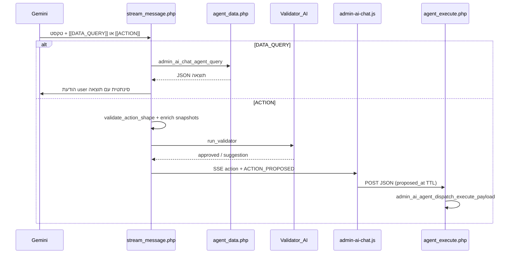

# תכנון: גישת הסוכן לעריכת קבצים בפרויקט

## איך זה עובד היום (רלוונטי להרחבה)

- שליפת DB: [`admin/features/ai_chat/api/stream_message.php`](admin/features/ai_chat/api/stream_message.php) (לולאת `while`, עד 3 `DATA_QUERY`) → [`admin_ai_chat_agent_query`](admin/features/ai_chat/api/agent_data.php).
- פעולות: בלוק `[[ACTION]]` → [`admin_ai_chat_validate_leaf_action_shape`](admin/features/ai_chat/api/stream_message.php) / `validate_action_shape` → העשרה ב-[`admin_ai_chat_enrich_proposed_action_with_snapshots`](admin/features/ai_chat/services/stream_history.php) → ביצוע ב-[`admin_ai_agent_dispatch_execute_payload`](admin/features/ai_chat/services/agent_execute_dispatch.php) אחרי אימות ב-[`agent_execute.php`](admin/features/ai_chat/api/agent_execute.php) (רשימת `action` מותרים, `program_admin`, התאמת טוקן, TTL 5 דקות).
- ממשק: [`admin-ai-chat.js`](admin/features/ai_chat/assets/admin-ai-chat.js) — `buildExecuteBodyFromLeaf` + `renderActionCard` / רצפים; undo דרך `undo_payload` שמוחזר מהשרת.

ההרחבה צריכה **להיצמד לאותו דפוס**: אין הרצת קבצים ישירות מהמודל — רק הצעה → אישור מנהל → ביצוע בשרת עם מדיניות קשיחה.

---

## עקרונות בטיחות (חובה לפני כל מימוש)

1. **Jail לפרויקט**: כל נתיב מחושב מול [`ROOT_PATH`](admin/features/ai_chat/bootstrap.php) (דרך `path.php`). אחרי נירמול: `realpath` של הקובץ חייב להיות תחת `realpath(ROOT_PATH)`; אחרת דחייה (`path_escape`).
2. **רשימת נתיבים/תיקיות חסומות** (דוגמאות): `.git/`, `vendor/`, `node_modules/`, קבצי סודות (`.env*`), `path.php`, אולי תיקיות העלאות גדולות אם קיימות — להגדיר במקום אחד בקובץ מדיניות חדש.
3. **רשימת prefix מורשים** (ברירת מחדל שמרנית): למשל רק `admin/`, `app/`, ואולי שורש קבצים סטטיים שמוגדרים במערכת — לא את כל `ROOT_PATH` בלי סינון.
4. **סיומות / סוג קובץ**: allowlist סיומות (למשל `.php`, `.css`, `.js`, `.md`, `.json` לפי הצורך) או לפחות denylist (`.pem`, `.key`, `.sql` אם לא רוצים dump וכו') — להחליט במדיניות אחת ועקבית.
5. **גודל**: מקסימום לקריאה בתוך הצ'אט (למשל 256–512KB) ומקסימום לכתיבה; מעבר לכך — דחייה או הוראה למנהל לערוך ידנית.
6. **מחיקה**: לסמן ב-UI כ־`dangerous` (כמו `delete` / SQL הרסני); בפרומפט — לדרוש `[[QUESTIONS]]` לפני הצעת מחיקה כשאין ודאות (כמו DDL הרסני היום).
7. **לוגים**: `admin_ai_agent_exec_log` / `ai_api_logs` עם path מקוצר (ללא תוכן קובץ מלא).
8. **הגנה מקריסת Syntax**: לפני כל כתיבה/patch לקובץ קיים, לבצע preflight lint על תוצר ביניים (קובץ `.tmp`) ולדחות את הפעולה אם יש שגיאת תחביר — בלי לדרוס את המקור.

---

## שכבה 1: קריאת קבצים (חובה לעריכה חכמה)

בלי קריאה, המודל ינחש תוכן. שתי אפשרויות עקביות עם הקוד הקיים:

- **מומלץ**: להוסיף `action: "file_read"` ב-[`admin_ai_chat_agent_query`](admin/features/ai_chat/api/agent_data.php) **לפני** בדיקת `table`/`admin_ai_agent_can_read`, עם `require` לשירות חדש.
- **חלופה**: בלוק נפרד `[[FILE_READ]]` ב-stream (כמו DATA_QUERY) — יותר עבודה כפולה בפרומפט וב־reply quality gate.

המימוש בפועל: קובץ חדש, למשל [`admin/features/ai_chat/services/agent_project_files.php`](admin/features/ai_chat/services/agent_project_files.php), עם:

- `admin_ai_agent_project_resolve_path(string $relative): array{ok,abs_path,display_path,error}` — נירמול, איסור `..`, בדיקת prefix, סיומת.
- `admin_ai_agent_project_file_read(...)`: החזרת `{ ok, path, content|truncated, sha1?, bytes }` או שגיאה מובנית.

ב-[`stream_message.php`](admin/features/ai_chat/api/stream_message.php): אותו לולאת `DATA_QUERY` — אם `action === file_read`, לספור מול אותו תקר `maxDataQueries` (או תקר נפרד `maxFileReads`).

עדכון פרומפט: [`admin_ai_chat_build_agent_instructions`](admin/features/ai_chat/services/prompt_builder.php) — סעיף "שליפת קובץ" עם דוגמת JSON וכלל "תמיד file_read לפני file_write על קיים".

---

## שכבה 2: פעולות קבצים דרך `[[ACTION]]` (Patch-First)

להוסיף סוגי עלה חדשים (בדומה ל־`send_mail` / `push_broadcast` — בלי `table`):

- `file_patch`: `path`, `search_block`, `replace_block`, `description`.
- `file_write`: נשאר רק ליצירה/החלפה מלאה במקרי קצה (למשל קובץ חדש), לא מסלול עריכה ברירת מחדל.
- `file_delete`: `path`, `description`.

מדיניות עריכה נקודתית:

1. ברירת מחדל לעריכת קובץ קיים: `file_patch` בלבד.
2. אם `search_block` לא נמצא — כשלון (`search_block_not_found`).
3. אם `search_block` מופיע יותר מפעם אחת — **לא** מחליפים אוטומטית; הפעולה נכשלת עם `ambiguous_match_found_make_search_block_larger` והמודל נדרש להציע מחדש `search_block` גדול וייחודי יותר.
4. `replace_block` יכול להיות מחרוזת ריקה למחיקה נקודתית של בלוק.
5. לפני patch, השרת קורא את הקובץ הנוכחי ומחשב checksum קצר (`before_sha1`) ללוג/וולידציה.
6. לפני החלפה סופית בדיסק, השרת מייצר תוכן חדש בזיכרון/בקובץ זמני ומריץ בדיקת תחביר לפי סוג קובץ (למשל PHP: `php -l temp.php`); כשלון מחזיר `status:error` עם פירוט ה-lint.

שינויים נקודתיים בקבצים:

1. [`stream_message.php`](admin/features/ai_chat/api/stream_message.php) — `admin_ai_chat_validate_leaf_action_shape`: להוסיף ענף `file_patch` (שדות חובה), ולהשאיר `file_write`/`file_delete`.
2. [`agent_execute.php`](admin/features/ai_chat/api/agent_execute.php) — להוסיף ל־`in_array(..., actions)`.
3. [`agent_execute_dispatch.php`](admin/features/ai_chat/services/agent_execute_dispatch.php) — לפני ענף ה־CRUD על טבלאות: טיפול ב־`file_patch`/`file_write`/`file_delete` עם אותו TTL; קריאה לפונקציות ב־`agent_project_files.php`.
4. [`agent_project_files.php`](admin/features/ai_chat/services/agent_project_files.php) — להוסיף `admin_ai_agent_project_validate_syntax(...)` עם מנגנון lint לפי שפה:
   - `.php` / `.phtml`: `php -l <tmp>`
   - קבצים אחרים: הרחבה עתידית לפי זמינות כלים; אם אין linter מוגדר, לפחות לבצע בדיקות מבניות בסיסיות ולהחזיר `syntax_check_skipped`.
5. **Undo** (לעקוב אחרי [`undo_payload`](admin/features/ai_chat/services/agent_execute_dispatch.php) הקיים):
   - אחרי `file_patch`: `undo_payload` = `file_patch` הפוך (`search_block` = `replace_block` שהוחלף בפועל, `replace_block` = הקטע המקורי), עם אותו context.
   - אם אי אפשר להבטיח patch הפוך חד-משמעי — fallback ל־`file_write` עם תוכן קודם מלא (עד מגבלת גודל).
   - אחרי `file_write` יוצר קובץ חדש: `undo_payload` = `file_delete`.
   - אחרי `file_delete`: `undo_payload` = `file_write` עם אותו path + תוכן גיבוי שנקרא לפני המחיקה.
6. [`stream_history.php`](admin/features/ai_chat/services/stream_history.php) — `enrich`: לפני ולידטור, אפשר להוסיף `before_excerpt` (כמה שורות) או hash ל־`file_write`/`file_delete` כדי שהוולידטור יוודא יעד; ב־`redact_action_payload_for_model` לקצר `content` דומה ל־`html_body` של מייל.

---

## שכבה 3: ממשק מנהל ו-JS (Diff ממוקד)

[`admin-ai-chat.js`](admin/features/ai_chat/assets/admin-ai-chat.js):

- `buildExecuteBodyFromLeaf`: להעביר `path`, `search_block`, `replace_block`, `content`.
- `renderActionCard`: ענף `file_patch` / `file_write` / `file_delete`:
  - ב־`file_patch`: להציג רק diff של קטע משתנה (removed/addded) ולא קובץ מלא.
  - `dangerous` למחיקה ולהחלפות רחבות.
- `executeAction` / `buildExecuteBodyFromLeaf` בקריאות קיימות — לוודא שדות חדשים נשמרים ב־`ACTION_PROPOSED` (כבר JSON דינמי).

CSS קל אם נדרש מחלקות `--file_patch`, `--file_write` (אופציונלי).

---

## שכבה 3.5: Git אוטומטי אחרי ביצוע מוצלח

דרישת מוצר מאושרת: אחרי `file_patch` מוצלח לבצע Git `commit + push` לענף הנוכחי.

מימוש מומלץ:

1. שירות חדש (למשל `agent_git_ops.php`) שמריץ פקודות Git ב־working directory של הפרויקט בלבד.
2. סדר פעולות:
   - `git rev-parse --abbrev-ref HEAD` לאימות ענף נוכחי.
   - `git add -- <path>` רק לקובץ שנערך.
   - `git commit -m "<auto message>"` עם מטא (chat_id, action).
   - `git push origin <current-branch>` (אם push מאופשר ויש הרשאות).
3. הגנות:
   - timeout קשיח לכל פקודה.
   - lock כדי למנוע ריצות מקבילות.
   - אם commit נכשל כי אין שינויים — תשובת הצלחה עם `git_status:no_changes`.
   - אם push נכשל — העריכה נשארת בדיסק אבל תוחזר אזהרה מפורטת ב־`executionResult`.
4. הרשאות וסודות:
   - השירות ירוץ תחת משתמש השרת; ברירת מחדל היא `commit_only` אם אין credentials.
   - אם מוגדר `GIT_PAT_TOKEN` בסביבה/`.env`, ניתן לבצע push ב-HTTPS בצורה לא-אינטראקטיבית.
   - אם `GIT_PAT_TOKEN` לא מוגדר או לא תקין: לבצע commit בלבד ולהחזיר `git_status:push_skipped_no_credentials`.
5. לוגים: לשמור stderr מקוצר בלבד (ללא דליפת סודות).

---

## שכבה 4: וולידטור AI ותיעוד פנימי

- [`admin_ai_chat_build_validator_instruction`](admin/features/ai_chat/services/prompt_builder.php): פסקה על `file_patch`/`file_delete` (ו-`file_write` רק למקרי יצירה/override), דרישת `file_read` קודם, ובדיקת התאמת `search_block` לבקשה.
- [`reply_quality_gate.php`](admin/features/ai_chat/services/reply_quality_gate.php): להזכיר גם `file_read` אם נוסף כבלוק/פעולה.

---

## שכבה 4.5: שינויי מסד ודוח SQL לסביבת production

מטרה: אם במהלך השיחה בוצעו שינויי DB (בעיקר DDL / DML מהותי), בסוף התהליך המנהל יקבל SQL מסכם להרצה ידנית באתר החי.

1. בכל `action:sql` מוצלח, לשמור תיעוד מובנה (chat_id, timestamp, sql, kind, table משוער) ברשומת audit ייעודית.
2. עבור פעולות CRUD שממופות ל-SQL פנימי, לשמור SQL לוגי שקול (או תיאור דטרמיניסטי) כדי שניתן יהיה להפיק script מסכם.
3. להוסיף endpoint/פעולה `export_sql_changes` שמחזירה:
   - בלוק SQL מסודר לפי סדר ביצוע.
   - הערות פתיחה עם תאריך, chat_id, ואזהרת הרצה על live.
4. אם לא בוצעו שינויי DB בשיחה — להחזיר הודעה מפורשת `no_db_changes_recorded`.

---

## שכבה 5: סכמת JS / סיכום למודל (אופציונלי)

[`admin_ai_agent_build_schema_for_js`](admin/features/ai_chat/services/agent_schema.php) — להוסיף לרשימת `actions` את שמות פעולות הקבצים כדי שההדגשה ב-UI תישאר עקבית.

---

## סיכונים שנשארים (מודעות מוצר)

- **תוכן רגיש בקוד**: גם עם jail, קוד PHP עלול להכיל סודות — החסימות וה־prefix חשובים; שקול denylist לקבצי config ספציפיים.
- **סביבת production**: אותו מנגנון רץ כמשתמש שרת ה־web — זה כוח מלא על הקבצים המורשים; לכן הדגש על allowlist ולא על "כל הפרויקט".
- **רצפים (`sequence`)**: בשלב ראשון מומלץ לאפשר `file_patch` כעלה ב-sequence רק אחרי שנבחן יציבות בודדים; `file_read` נשאר ב-DATA_QUERY.
- **Git אוטומטי**: `push` עשוי להיכשל (הרשאות/קונפליקט/remote down). חייבים להפוך את כשל ה-push לתוצאה מפורשת ב-UI כדי שהמנהל לא יניח שהכל סונכרן.
- **Syntax-check coverage**: בשלב ראשון lint מלא מובטח בעיקר ל-PHP; לסוגי קבצים אחרים נדרש להגדיר כלי lint ייעודי לפני enforce קשיח.

---

## סדר מימוש מומלץ

1. `agent_project_files.php` — resolve + read + patch + write + delete + בדיקות גודל ומנגנון match (כולל שגיאת ambiguity שמחזירה הנחיה להגדלת `search_block`).
2. `admin_ai_chat_agent_query` + לולאת stream ל־`file_read`.
3. להוסיף preflight syntax-check אטומי לפני כל write/patch סופי.
4. ולידציה + dispatch + undo + רשימת actions ב־`agent_execute` (כולל `file_patch`).
5. שכבת Git אוטומטי (commit + push לענף הנוכחי) עם PAT/fallback ושדות result ב-`EXECUTION_RESULT`.
6. JS כרטיס diff + תוצאות Git + שגיאות lint ברורות.
7. פרומפט + וולידטור + redaction.
8. שכבת audit + ייצוא SQL מסכם לשינויים במסד.

לאחר מכן בדיקות ידניות: נתיב חוקי, ניסיון `../`, ניסיון סיומת אסורה, patch חד-משמעי, patch עמום (נכשל עם `ambiguous_match_found_make_search_block_larger`), שגיאת תחביר PHP שנחסמת לפני דריסה, מחיקה + undo, commit success, push skipped ללא PAT, push failure, ותיעוד נכון ב־`[[EXECUTION_RESULT]]` ובדוח SQL הסופי.
