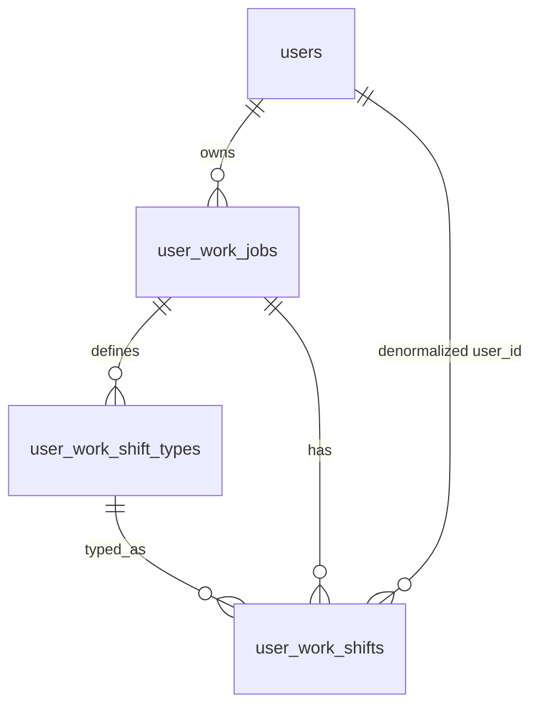

# איפיון: מעקב אחר סידור עבודה (עבודות + משמרות)

## מטרה

לאפשר למשתמשים (בהרשאה מפורשת) לנהל **מספר עבודות**, לכל אחת **יום קבלת שכר חוזר**, **סוגי משמרות** (רב-לשוני לוגית — רב סוגים לעבודה), ורישום **משמרות** ב**לוח שנה** רספונסיבי, עם **הוספה מהירה** מכפתור הפלוס בתפריט התחתון.

## היקף מוצרי (מסכמים)

| אזור | התנהגות |
|------|---------|
| **הפעלה** | רק משתמשים שסומנו בפאנל ניהול; **ברירת מחדל: כבוי** (עמוד ותפריט מוסתרים). |
| **עמוד** | אם **אין אף עבודה** — אשף first-time (דומה בזרימה ל־[pages/shopping.php](pages/shopping.php) כשאין חנויות: כרטיס welcome, שלבים, שמירה). אחרי שיש עבודה — לוח חודשי + ניווט חודשים. |
| **תפריט תחתון** | כרטיסייה חדשה (למשל "עבודה" / "סידור") **רק** כשהדגל פעיל; ה־[FAB](assets/includes/sidebar_bavbar.php) — **אייקון פלוס** → פתיחת **מודל הוספת משמרת מהירה** (תאריך, עבודה, סוג משמרת, שעות). **אין ברירת מחדל לעבודה** — חובה לבחור עבודה בכל פתיחה (שדה ריק / placeholder עד בחירה). |
| **ניהול עבודות** | יצירה/עריכה/מחיקה (רשימה או מסך "הגדרות עבודה" — מינימום CRUD אחרי האשף). **מחיקת עבודה**: מחיקה מדורגת — נמחקים גם כל סוגי המשמרות והמשמרות שלה; **לפני ביצוע — דיאלוג אישור חד-פעמי** המסביר שכל המשמרות יימחקו. |
| **סוגי משמרות** | מוגדרים **בהגדרת עבודה** (ויזארד + עריכה), מספר סוגים; **אייקון קבוע אופציונלי** (בוקר / ערב / ביניים / לילה) לזיהות מהיר בלוח. |
| **עבודה (מקום עבודה)** | **צבע ייחודי** — הלוח מציג את **כל** העבודות של המשתמש; הצבע מבדיל בין מקורות (פס/גבול/נקודה; לא סתירה עם סוגי משמרות). |
| **לחיצה על משמרת** | פותחת **מודל עריכה** (אותו/דומה להוספה מהירה): שינוי שעות, עבודה, סוג, הערה, **מחיקה**. |

## מודל נתונים (מסכנה)

**שדה חדש ב־`users`**

- `work_schedule_enabled` (או שם אחיד) — `TINYINT(1) NOT NULL DEFAULT 0`.
- אינדקס לא נדרש לרוב; אפשר `KEY` אם יש דוחות/סינון המוני.

**טבלאות ייעודיות (שמות מוצעים)**

1. **`user_work_jobs`** — עבודה של משתמש  
   - `id`, `user_id` (FK → `users`), `title` (שם העבודה),  
   - **`color`** — `VARCHAR(7)` (למשל `#RRGGBB`) **או** ערך מפתח מ-palette מוגדר מראש (8–12 צבעים ב־UI); ברירת מחדל אוטומטית אם ריק. שימוש עיקרי: **הבחנה בין עבודות בלוח** כשמוצגים כל הסידורים יחד.  
   - **`payday_day_of_month`** `TINYINT` — יום 1–31 (שכר חוזר; הרחבה עתידית: תאריך אבסולוטי).  
   - `sort_order`, `created_at`, `updated_at`.
   - אילוץ: `user_id` + בדיקת בעלות בכל שאילתה בצד API.

2. **`user_work_shift_types`**  
   - `id`, `job_id` (FK), `name`, `sort_order`,  
   - **`icon_preset`** — `VARCHAR(24) NOT NULL DEFAULT ''` עם ערכים מוסכמים: `morning` | `evening` | `mid` | `night` | `''` (ללא) — ב־UI: בחירה מ-4+ אייקונים (Font Awesome קבועים, למשל `fa-sun`, `fa-moon` וכו') לפי הערך. **לא** כפילות ל־"צבע העבודה" — האייקון מסמן **סוג** בתוך אותו צבע עבודה.

3. **`user_work_shifts`**  
   - `id`, `user_id` (FK — לאזורי הרשאה מהירה), `job_id`, `shift_type_id` (nullable אם "ללא סוג"),  
   - **`starts_at`**, **`ends_at`** — `DATETIME` (תומך משמרת חוצת חצות),  
   - אופציונלי: `note`, `created_at`, `updated_at`.  
   - אינדקס: `(user_id, starts_at)` או `(job_id, starts_at)` לשליפה לפי חודש.

**דיאגרמת ישויות (מקוצרת)**

## פאנל ניהול (אדמין)

- **מיגרציה** SQL ב־[docs/database/migrations/](docs/database/migrations/) (בדומה ל־[20260410_users_add_phone.sql](docs/database/migrations/20260410_users_add_phone.sql)).
- עדכון [admin/config/registry.php](admin/config/registry.php) לטבלת `users`: שדה `checkbox` (או `enum` 0/1) ב־`fields`, הוספה ל־`list_columns` אם נדרש סינון מבט.
- הערה: [admin/table.php](admin/table.php) + registry כבר מכסים עריכה — **אין** צורה ב"דשבורד" נפרד אלא בעריכת משתמש.

## אפליקציית המשתמש

### שילוב בניווט וסשן

- ב־[assets/includes/sidebar_bavbar.php](assets/includes/sidebar_bavbar.php) כבר נטען `selectOne('users', ...)` לסנכרון `role` — **להרחיב** את אותה שליפה (או query אחת ממוזגת) לשדה `work_schedule_enabled`.
- **לבנות את מערך `$navigation` דינמית**: אם הדגל פעיל, להוסיף פריט (למשל `work_schedule.php`) עם `plus_modal` שמפנה למודל בעמוד החדש (למשל `work-shift-quick-modal`).
- **FAB**: עבור דף סידור העבודה — לפי הדרישה: **תמיד פלוס** (לא special-case כמו `shopping.php` עם אשפת מחיקה) → `onclick` לפתיחת מודל המשמרת המהירה.

**הערת UI**: התפריט התחתון מבוסס רוחב קבוע לפריט ([assets/css/user.css](assets/css/user.css) — `.bottom-nav-bar`, `.list` ~70px). עם 5 כרטיסיות ייתכן צורך בהתאמות (גלילה אופקית קלה, `flex-shrink`, או הקטנת רוחב טקסט) — לבדוק במובייל במימוש.

### דף חדש (מסלול מוצע)

- קובץ: למשל [pages/work_schedule.php](pages/work_schedule.php) (או שם אחיד בעברית ב־URL — עקבי לשאר `pages/*.php`).
- כולל: `path.php`, `db.php`, `auth_check.php`, `sidebar_bavbar.php`, מטא/כותרת.
- **מצב אשף** (אין עבודות): מבנה דומה ל־`shopping-welcome-card` / `shopping-wizard-step` ב־[pages/shopping.php](pages/shopping.php): שם עבודה → **בחירת צבע** (palette) → יום שכר בחודש → בחירת/הוספת סוגי משמרות (**שם + אייקון קבוע אופציונלי** לכל סוג) → שמירה ב־API.
- **מצב לוח**: כותרת + **ניווט חודש** (חצים/שמות חודשים בעברית), **גריד 7×N** (ימי השבוע RTL), תאי יום עם משמרות: **פס/רקע/גבול לפי `job.color`**, **אייקון קטן לפי `shift_type.icon_preset`**, שעות כטקסט; `min-height` וגלילה. **משמרת חוצת חצות**: מוצגת **ביום ההתחלה בלבד**, עם **פס/טווח ויזואלי** המדגיש שהמשמרת ממשיכה ליום הבא (לא שכפול ליום הסיום). **לחיצה** על בלוק משמרת → **מודל עריכה** (מילוי אוטומטי, שמירה/ביטול/מחיקה). **מקרא (legend)** אופציונלי מעל הלוח: שם עבודה + ריבוע צבע. responsive: מסכים קטנים — תאים/טקסט מוקטנים, או רשימה יומית (שלב 2).

### API (מומלץ)

- קבצי `app/ajax/work_schedule_*.php` (או מרכז אחד עם `action`) — אימות `$_SESSION['id']`, ולידציה, JSON.
- פעולות: CRUD עבודות (כולל `color`); **מחיקת עבודה** — `DELETE`/`cascade` ב־DB או טרנזקציה שמוחקת משמרות וסוגים; CRUD סוגי משמרות (כולל `icon_preset`); CRUD משמרות; `list` לפי טווח תאריכים (חודש נוכחי ± מעט) עם `JOIN` לעבודה ולסוג משמרת לצבע/אייקון.
- **אותו מודל/טופס** (או קומפוננטה JS משותפת) ל"הוספה מהירה" ול"עריכה" — חוסך שכפול לוגיקה; בעריכה: `PUT`/action `update` + כפתור מחיקה.

**אבטחה**: כל `job_id` / `shift_id` — לוודא `user_id` תואם למשתמש המחובר (לא לסמוך על body בלבד).

## עיצוב

- שימוש ב־CSS variables ודפוסים מ־[assets/css/user.css](assets/css/user.css) (`.section-title`, כרטיסים, מודלים — כמו בקניות/דפים אחרים).
- מחלקה ייעודית, למשל `.work-cal-*` / `.ws-*`, כדי לא לזהם גלובלית.

## נגישות (בהיקף v1)

- **`aria-label`** (או `aria-labelledby`) על בלוק משמרת בלוח: עבודה, שעות, סוג; על כפתורי ניווט חודש, FAB, סגירת מודל.
- **מודלים** (הוספה/עריכה): מיקוד מנוהל (`focus trap` או לפחות `focus` ראשון לשדה/סגירה), **מקלדת** — Tab סביר, סגירה ב־Esc אם אפשר, `role="dialog"` + `aria-modal="true"` בהתאם לדפוסי המודלים הקיימים בפרויקט.

_מסונן מהיקף: סינון עבודות בלוח, שכפול/העתקת משמרת, ייצוא ICS / תזכורת שכר, תבנית שבועי קבוע, סטטיסטיקת שעות לחודש._

## החלטות התנהגות (אושרו לפני בנייה)

1. **משמרת חוצת חצות (לילה)**: **הצגה ביום ההתחלה בלבד**; **פס/טווח** שממחיש שהסיום ביום הבא (ויזואלית עשיר, לא הופעה כפולה ביום הסיום).
2. **מחיקת עבודה**: **מחיקה מדורגת** (משמרות + סוגי משמרות) אחרי **אישור חד-פעמי** בדיאלוג.
3. **הוספה מהירה (FAB)**: **אין ברירת מחדל לעבודה** — המשתמש חייב לבחור עבודה בכל פתיחת מודל.

## סיכונים / החלטות שמורות למימוש (ברירת מחדל מומלצת)

1. **תאריך שכר**: יום בחודש (1–31) — פשוט וברור. אם חסר 29–31 בחודשים קצרים — UI מציין/מתקן (למשל 28/29 בפברואר) או מגביל בחירה.
2. **חפיפת משמרות / עבודות שונות**: מותר; הצגה ביום — רשימה/Stack.
3. **מודל נתונים לילה**: `starts_at` / `ends_at` כ־`DATETIME` — כש־`ends_at` ביום אחר מ־`starts_at`, ה־API מחזיר טווח מלא; ה־UI בלוח כמתואר ב"החלטות התנהגות" (יום אחד + פס המשכיות).

## קבצים מרכזיים לשינוי/הוספה (צ'ק-ליסט)

- מיגרציה + אופציונלי `tazrim_ensure_*` ב־[app/database/db.php](app/database/db.php) אם הפרויקט נוהג ליצור טבלאות בזמן ריצה.
- [admin/config/registry.php](admin/config/registry.php) — שדה משתמש.
- [assets/includes/sidebar_bavbar.php](assets/includes/sidebar_bavbar.php) — שליפה, פריט nav מותנה, `plus_modal` + התאמת FAB לדף החדש.
- [assets/css/user.css](assets/css/user.css) — סגנונות לוח + אשף.
- [pages/work_schedule.php](pages/work_schedule.php) — HTML + JS (או קובץ JS נפרד תחת `assets/js/` אם מעמיסים).
- [pages/login.php](pages/login.php) + נקודות remember-token — **אופציונלי**: הוספת השדה ל־`$_SESSION` בכניסה כדי לחסוך שדה אחד בשליפה; אם לא — מספיק השליפה ב־sidebar.

## סדר ביצוע מומלץ

1. DB + registry + אימות עריכה באדמין.  
2. API + בדיקות ידניות.  
3. אשף + דף לוח (חודש נוכחי, ניווט).  
4. שילוב ניווט + FAB + ליטוש רספונסיבי.
